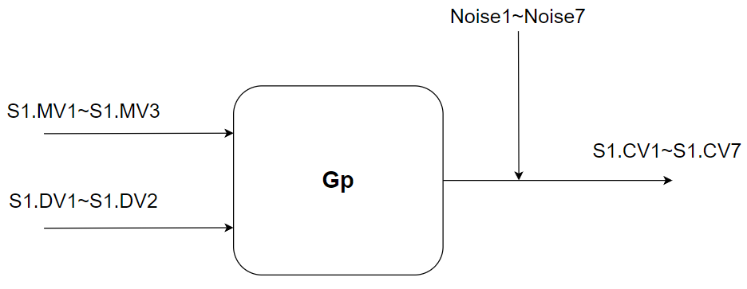
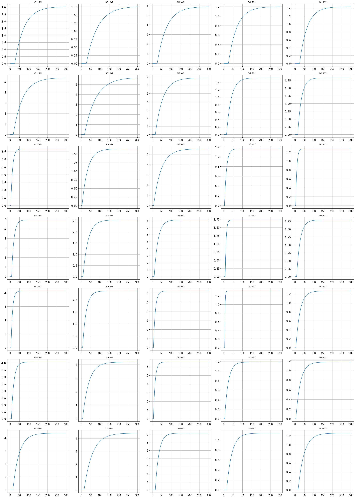
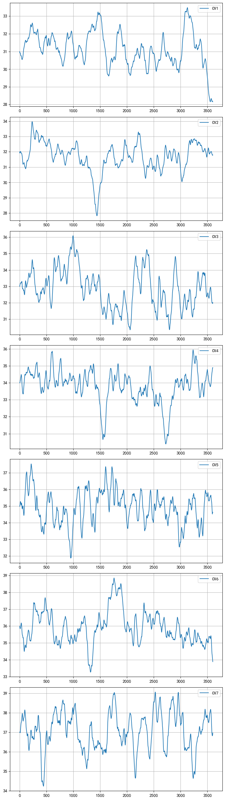
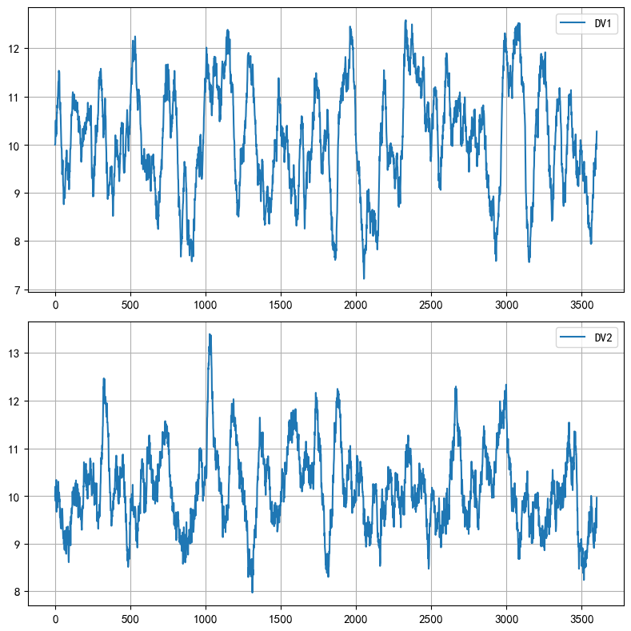

# 仿真环境说明

## 1. 仿真环境概述

      
       
      图1.1 主要仿真环境

$$
\begin{aligned}
\begin{bmatrix}
\text{CV1} \\[3ex] \text{CV2} \\[3ex] \text{CV3} \\[3ex] \text{CV4} \\[3ex] \text{CV5} \\[3ex] \text{CV6} \\[3ex] \text{CV7}
\end{bmatrix}

 &= \begin{bmatrix}
\dfrac{4.05}{50s+1}e^{-25s} & \dfrac{1.77}{60s+1}e^{-27s} & \dfrac{5.88}{50s+1}e^{-25s} & \dfrac{1.20}{45s+1}e^{-25s} & \dfrac{1.44}{40s+1}e^{-25s} \\[2ex]
\dfrac{5.39}{50s+1}e^{-17s} & \dfrac{5.72}{60s+1}e^{-17s} & \dfrac{6.90}{40s+1}e^{-15s} & \dfrac{1.52}{25s+1}e^{-15s} & \dfrac{1.83}{20s+1}e^{-15s} \\[2ex]
\dfrac{3.66}{9s+1}e^{-4s} & \dfrac{1.65}{30s+1}e^{-4s} & \dfrac{5.53}{40s+1}e^{-6s} & \dfrac{1.16}{11s+1}e^{-4s} & \dfrac{1.7}{6s+1}e^{-4s} \\[2ex]
\dfrac{5.92}{12s+1}e^{-8s} & \dfrac{2.54}{27s+1}e^{-9s} & \dfrac{8.10}{20s+1}e^{-9s} & \dfrac{1.73}{5s+1}e^{-8s} & \dfrac{1.79}{19s+1}e^{-9s} \\[2ex]
\dfrac{4.13}{8s+1}e^{-5s} & \dfrac{2.38}{19s+1}e^{-7s} & \dfrac{6.23}{10s+1}e^{-5s} & \dfrac{1.31}{2s+1}e^{-5s} & \dfrac{1.26}{22s+1}e^{-5s} \\[2ex]
\dfrac{4.06}{13s+1}e^{-7s} & \dfrac{4.18}{33s+1}e^{-7s} & \dfrac{6.53}{9s+1}e^{-5s} & \dfrac{1.19}{19s+1}e^{-5s} & \dfrac{1.17}{24s+1}e^{-5s} \\[2ex]
\dfrac{4.38}{33s+1}e^{-15s} & \dfrac{4.42}{44s+1}e^{-15s} & \dfrac{7.20}{19s+1}e^{-15s} & \dfrac{1.14}{27s+1}e^{-16s} & \dfrac{1.26}{32s+1}e^{-17s} \\
\end{bmatrix}\cdot
\begin{bmatrix}
\text{MV1} \\[6.5ex] \text{MV2} \\[6.5ex] \text{MV3} \\[6.5ex] \text{DV1} \\[6.5ex] \text{DV2} 
\end{bmatrix}
\end{aligned}
$$

      
       
      图1.2 被控对象阶跃响应

仿真环境中的不可测干扰项为：
$$
\begin{aligned}
\text{Noise1,Noise2} &= \dfrac{1-0.5q^{-1}+0.7q^{-2}}{(1-0.95q^{-1})(1-0.99q^{-2})} \cdot e(t) \\
\text{Noise3,Noise4,Noise6,Noise7} &= \dfrac{1-0.5q^{-1}+0.7q^{-2}}{(1-0.95q^{-1})(1-0.98q^{-2})} \cdot e(t) \\
\text{Noise5} &= \dfrac{1-0.5q^{-1}+0.7q^{-2}}{(1-0.95q^{-1})(1-0.97q^{-2})} \cdot e(t) \\

\text{DV1,DV2} &=  \dfrac{1+0.7q^{-1}}{(1-0.95q^{-1})(1-0.95q^{-2})} \cdot e_1(t) + 10\cdot\dfrac{1+0.7q^{-1}}{(1-0.15q^{-1})(1-0.19q^{-2})} \cdot e_2(t)
\end{aligned}
$$

通过S1.SET_CV_STD位号，可以设置不可测干扰(Noise)的标准差，其默认值为0。

      
       
      图1.3 3600个采样点的不可测干扰，标准差为1.0

通过设置S1.SET_DV_RANDOM位号（0或1），可以对系统加入标准差为1.3的DV1信号和标准差为0.9的DV2信号。

      
       
      图1.4 3600个采样点的DV1和DV2信号

