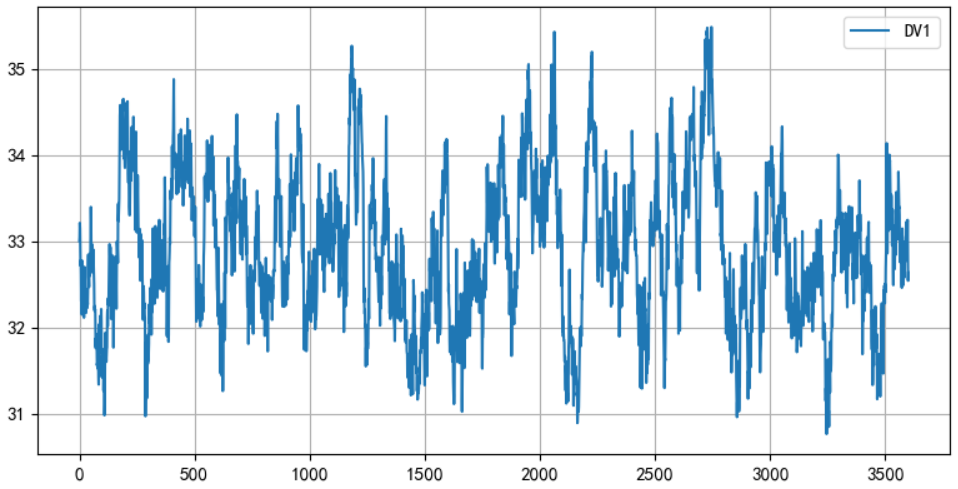

# 仿真环境说明

## 1. 仿真环境概述

      
       
      图1.1 主要仿真环境

$$
\begin{aligned}
\text{Gp} &= \frac{0.08}{s(30s+1)}e^{-17s} \\
\text{Gf} &= \frac{0.06}{s(20s+1)}e^{-4s}
\end{aligned}
$$

      
       
      图1.2 被控对象阶跃响应

仿真环境中的不可测干扰项为：
$$
\begin{aligned}
\text{Noise} &= \frac{1-0.5q^{-1}+0.3q^{-2}}{(1-0.99q^{-1})(1-0.99q^{-2})} \cdot e(t) \\
\text{DV1} &=  \frac{1+0.7q^{-1}-0.1q^{-2}}{(1-0.95q^{-1})(1-0.92q^{-2})} \cdot e_1(t) + 10\cdot\frac{1+0.7q^{-1}-0.1q^{-2}}{(1-0.15q^{-1})(1-0.19q^{-2})} \cdot e_2(t)
\end{aligned}
$$

通过T2.SET_CV_STD位号，可以设置不可测干扰(Noise)的标准差，其默认值为0。

      
       
      图1.3 3600个采样点的不可测干扰，标准差为1.0

通过设置T2.SET_DV_RANDOM位号（0或1），可以对系统加入标准差为1.0的DV1信号。

      
       
      图1.4 3600个采样点的DV1信号

## 2. 平行的PID仿真环境

      
       
      图2.1 PID仿真环境

默认PID控制器的参数为：
$$
\begin{aligned}
K_P = 0.2, T_I = 150 \\
T_D = 20, N = 100 \\
\end{aligned}
$$

$$
\text{PID} = K_P(1 + \frac{1}{T_Is} + \frac{T_Ds}{\frac{T_D}{N}s + 1})
$$

      
       
      图2.2 PID闭环阶跃响应

## 3. 平行的开环仿真环境

      
       
      图3 平行仿真环境

