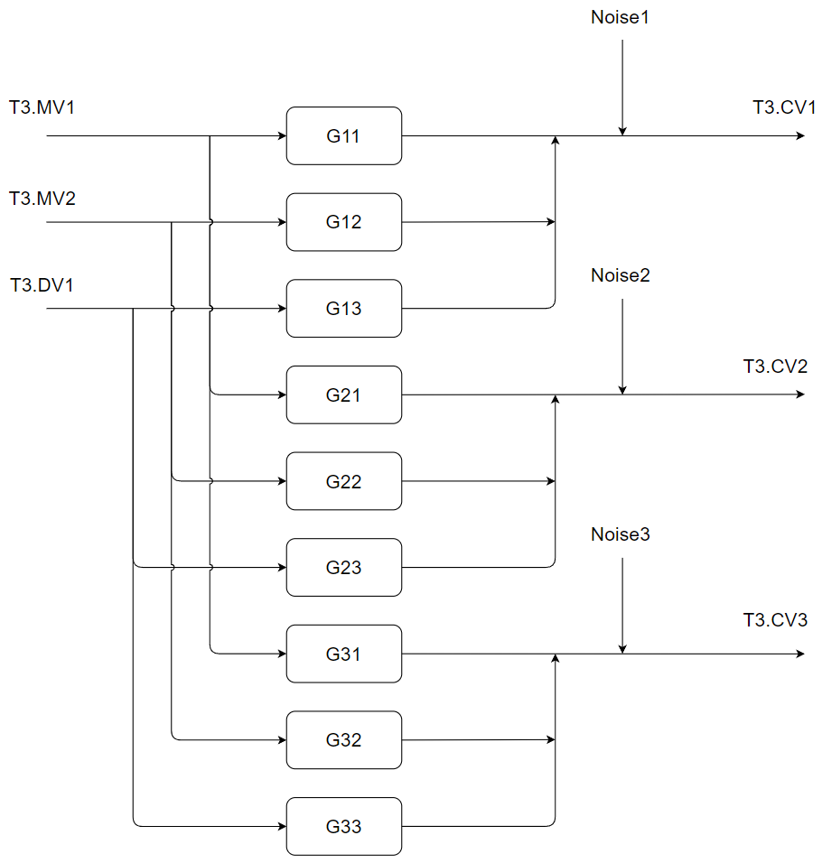
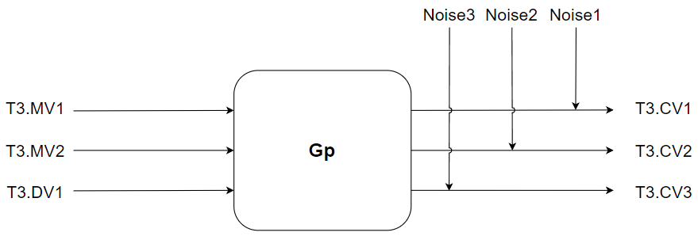
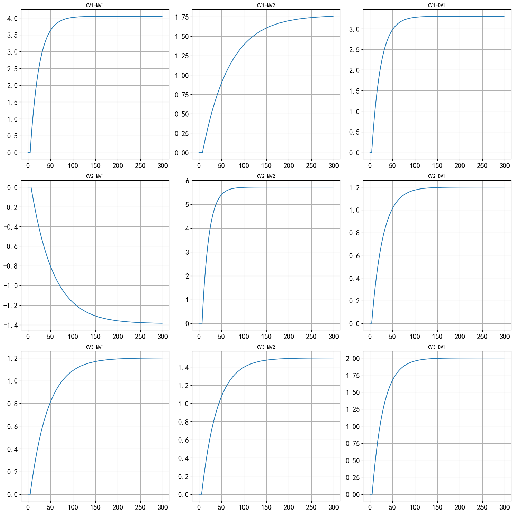
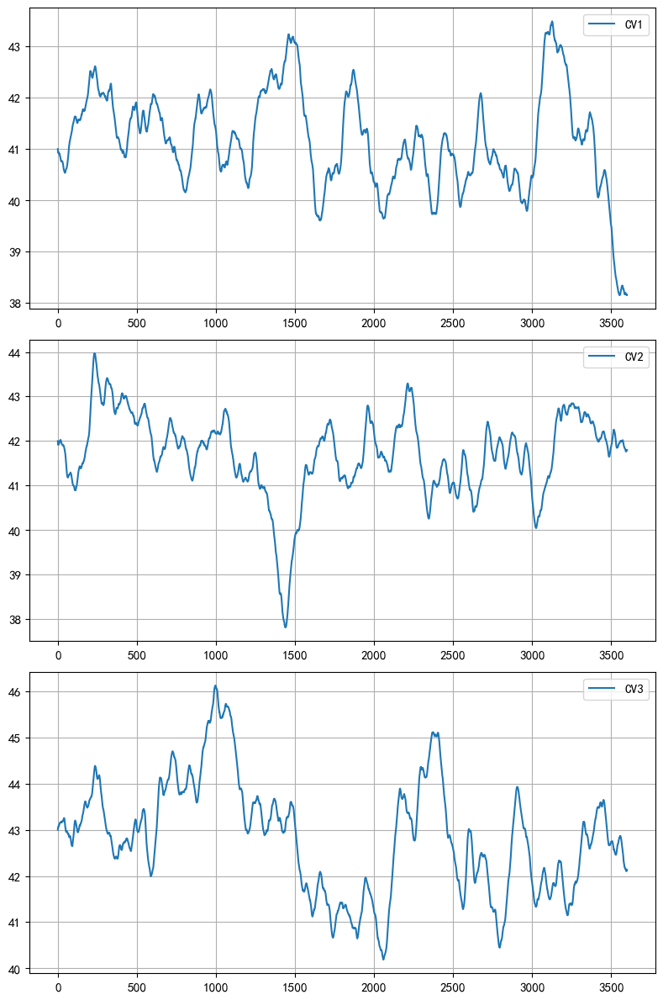
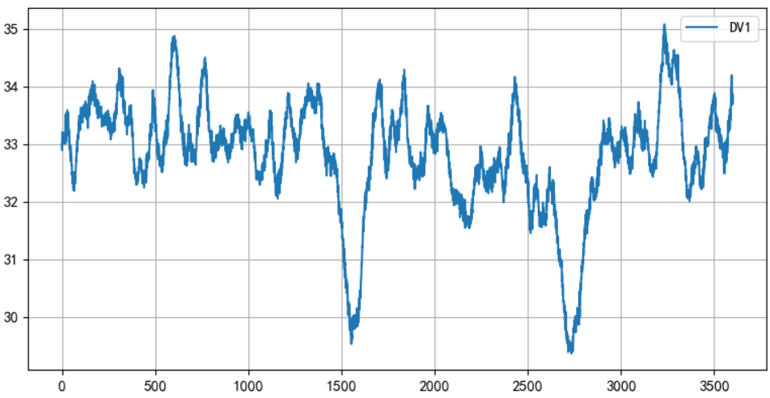

# 仿真环境说明

## 1. 仿真环境概述

      
       
      图1.1 主要仿真环境

      
       
      图1.2 主要仿真环境

$$
\begin{aligned}
\textbf{Gp} &= \begin{bmatrix}
\text{G11} & \text{G12} & \text{G13} \\[2ex]
\text{G21} & \text{G22} & \text{G33} \\[2ex]
\text{G31} & \text{G22} & \text{G33} \\
\end{bmatrix} = \begin{bmatrix}
\dfrac{4.05}{20s+1}e^{-5s} & \dfrac{1.77}{60s+1}e^{-8s} & \dfrac{3.3}{20s+1}e^{-4s} \\[2ex]
\dfrac{-1.39}{50s+1}e^{-7s} & \dfrac{5.72}{15s+1}e^{-7s} & \dfrac{1.2}{25s+1}e^{-4s} \\[2ex]
\dfrac{1.2}{40s+1}e^{-5s} & \dfrac{1.5}{35s+1}e^{-6s} & \dfrac{2.0}{25s+1}e^{-5s}
\end{bmatrix}
\end{aligned}
$$

      
       
      图1.3 被控对象阶跃响应

仿真环境中的不可测干扰项为：
$$
\begin{aligned}
\text{Noise1,Noise2,Noise3} &= \dfrac{1-0.5q^{-1}+0.3q^{-2}}{(1-0.95q^{-1})(1-0.99q^{-2})} \cdot e_x(t) \\
\text{DV1} &=  \dfrac{1-0.5q^{-1}+0.7q^{-2}}{(1-0.97q^{-1})(1-0.97q^{-2})} \cdot e_1(t) + 10\cdot\dfrac{1-0.5q^{-1}+0.7q^{-2}}{(1-0.15q^{-1})(1-0.19q^{-2})} \cdot e_2(t)
\end{aligned}
$$

通过T3.SET_CV_STD位号，可以设置不可测干扰(Noise)的标准差，其默认值为0。

      
       
      图1.4 3600个采样点的不可测干扰，标准差为1.0

通过设置T3.SET_DV_RANDOM位号（0或1），可以对系统加入标准差为1.0的DV1信号。

      
       
      图1.5 3600个采样点的DV1信号

